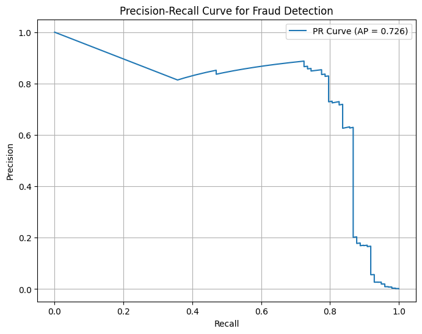

# Fraud Detection ML Project

## Overview

This project builds a machine learning model to detect fraudulent credit card transactions using tabular data and scikit-learn.

The goal is to go beyond basic modeling by addressing real-world challenges such as **class imbalance** and **precision-recall tradeoffs**, while building a project that can later integrate with a Personal Finance API.

---

## Problem Statement

Fraud detection is a highly imbalanced classification problem where fraudulent transactions are extremely rare but critical to detect.

A naive model can achieve high accuracy by predicting all transactions as non-fraud, but this fails to detect actual fraud cases.

---

## Dataset

* Credit Card Fraud Detection dataset
* ~284,807 transactions
* Target variable: `Class`

  * `0` → Normal
  * `1` → Fraud
* Highly imbalanced:

  * ~99.8% normal
  * ~0.2% fraud

---

## Approach

### 1. Data Exploration

* Loaded dataset using pandas
* Verified no missing values
* Identified extreme class imbalance

### 2. Baseline Model

* Logistic Regression (scikit-learn)
* Observed high accuracy but poor fraud detection

### 3. Handling Class Imbalance

* Applied `class_weight='balanced'`
* Improved fraud recall significantly

### 4. Threshold Tuning

* Used predicted probabilities instead of default threshold (0.5)
* Tested multiple thresholds to balance precision and recall

---

## Results

### Baseline Model

* Accuracy: ~99.9%
* Fraud Recall: ~56%
* Insight: High accuracy but misses many fraud cases

### Balanced Model

* Fraud Recall: ~92%
* Fraud Precision: very low (~6%)
* Insight: Captures most fraud but produces many false positives

### Threshold Tuning

| Threshold | Precision | Recall |
| --------- | --------- | ------ |
| 0.3       | 0.03      | 0.93   |
| 0.6       | 0.09      | 0.92   |
| 0.9       | 0.28      | 0.87   |

**Key Insight:**
There is a clear tradeoff between precision and recall. In fraud detection, recall is prioritized, but extremely low precision can make the system impractical.

---

## Precision-Recall Curve


The precision-recall curve helps evaluate model performance on the minority fraud class, which is more informative than accuracy for this highly imbalanced dataset.
---

## Key Learnings

* Accuracy is misleading for imbalanced datasets
* Precision and recall are more meaningful metrics
* Class weighting can significantly improve recall
* Threshold tuning is critical for real-world usability

---

## Future Work

* Evaluate model using ROC-AUC
* Try alternative models (Random Forest, Gradient Boosting)
* Implement anomaly detection approaches
* Integrate model with Personal Finance API for real-time fraud flagging

---

## Tech Stack

* Python
* pandas
* scikit-learn
* Jupyter Notebook

---

## Project Structure

```
fraud-detection-ml/
├── data/
├── notebooks/
│   └── eda.ipynb
├── src/
├── README.md
└── requirements.txt
```
